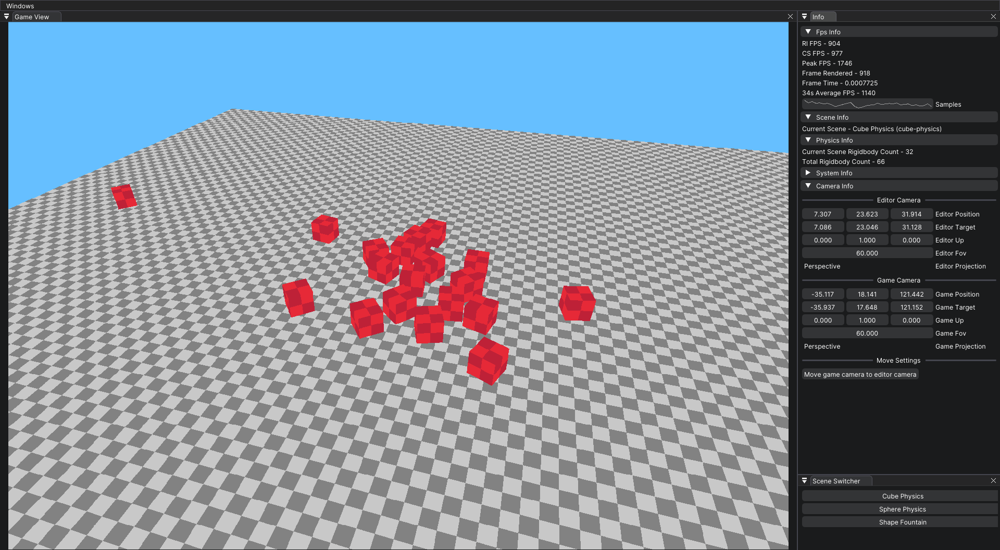
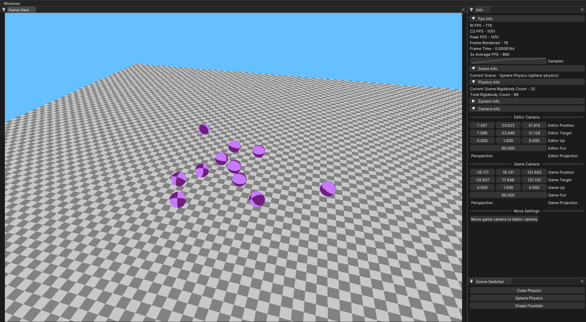
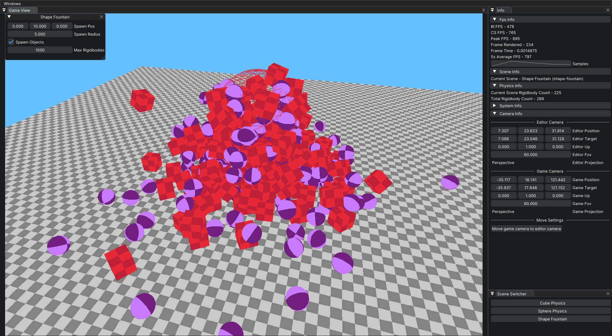
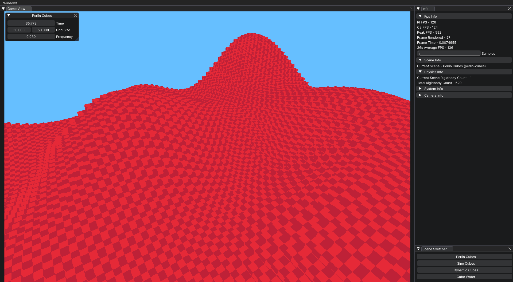
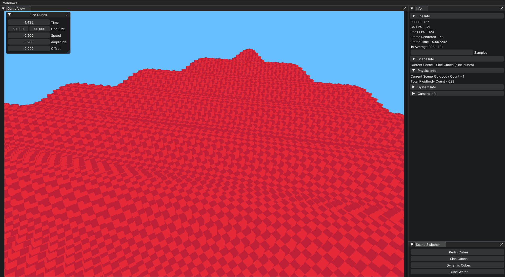
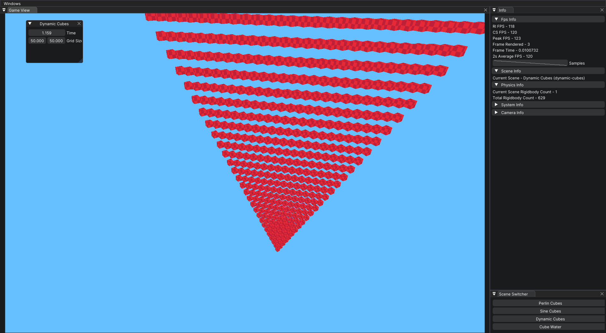
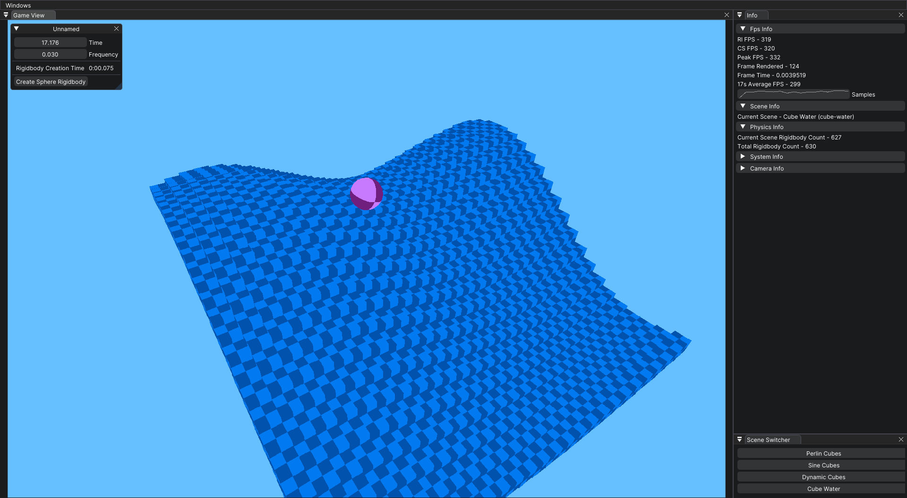

# Copper Sandbox

> Collection of sandbox games each with a different theme/genre

## Current Sandboxes

- Physics
- Procedural
- Testing

### Physics Sandbox

The physics sandbox contains three scenes. `Cube Physics` which has 30 cubes, `Sphere Physics` which has 30 spheres,
and `Shape Fountain` which has a 'fountain' that spawns multiple physics objects at a time.




### Procedural Sandbox

The procedural sandbox contains four scenes. `Perlin Cubes` which has a 50x50 grid of cubes following a perlin noise
pattern, `Sine Cubes` which is a 50x50 grid of cubes following a sine noise pattern. `Dynamic Cubes` is a 50x50 grid of
cubes following a simple pattern always moving up. This is used for testing and both the sine cubes and perlin cubes are
based off of this. `Cube Water` is `Perlin Cubes` but with a smaller grid of 25x25 and the ability for these cubes to be
collidable with physics.





## Sandbox Engine

Simple engine built specifically for making sandbox style games with simple `ImGui` UI.

## Libraries Used

- [Raylib](https://github.com/raysan5/raylib)/[Raylib-CsLo](https://github.com/NotNotTech/Raylib-CsLo)
- [Jitter Physics](https://github.com/notgiven688/jitterphysics)
- [Dear Imgui](https://github.com/ocornut/imgui)/[ImGui.NET](https://github.com/JoeTwizzle/ImGui.NET)

## Documentation

Starting the engine with all settings used
```csharp
    var engineSettings = new EngineSettings
    {
        WindowStartSize = new Vector2Int(600, 450),
        WindowTitle = "New Sandbox",
        WindowFlags = ConfigFlags.FLAG_MSAA_4X_HINT | ConfigFlags.FLAG_WINDOW_RESIZABLE,
        EngineConfig = EngineConfig.EditorEnabled | EngineConfig.EditorAtStart | EngineConfig.DebugVisuals
    };
    CopperEngine.Initialize(engineSettings);
        
    // user added stuff here - scenes, gameobjects, custom ui,
        
    CopperEngine.Update();
```

Creating a new scene

```csharp
    var newScene = new Scene("Scene Display Name", "scene-id");
```

Adding new component to a scene
```csharp
    // Both of these do the same thing, just looks slightly different
    // CameraController is a built in first person free camera controller
    newScene.AddComponent(new CameraController());
    newScene.AddComponent<CameraController>();
```

Loading a scene through code
```csharp
    SceneManager.LoadScene("scene-id");
```

Creating a custom component
```csharp
    // New class that simply inherits from CopperComponent. From here override the included functions
    public class NewComponent : CopperComponent
    {
        
    }
```

Creating a custom engine window
```csharp
    // CopperWindow is built on top of CopperComponent so its basically the same except CopperWindow overrides UiUpdate in CopperComponent, but provides WindowUpdate as an overridable method. 
    public class NewWindow : CopperWindow
    {
        
    }
```

Many built in [Raylib](https://www.raylib.com/cheatsheet/cheatsheet.html) functions have a corresponding Utility method. Here are a couple examples. This is mainly done so Raylib methods using unsafe can not.
```csharp
    // Raylib
    var image = Raylib.LoadImage(path);
    
    // CopperEngine
    var image = ImageUtil.LoadImage(path);
```

```csharp
    // Raylib
    var deltaTime = Raylib.GetFrameTime();
    var totalTime = Raylib.GetTime();
    Raylib.WaitTime(seconds);
    
    // CopperEngine
    var deltaTime = Time.DeltaTime;
    var totalTime = Time.TotalTime;
    Time.Wait(seconds);
``` 
    
```csharp
    // Raylib
    Raylib.MaximizeWindow();
    Raylib.MinimizeWindow();
    Raylib.GetScreenWidth();
    Raylib.GetScreenHeight();
    
    // CopperEngine
    Window.Maximize();
    Window.Minimize();
    Window.GetScreenWidth();
    Window.GetScreenHeight();
```
